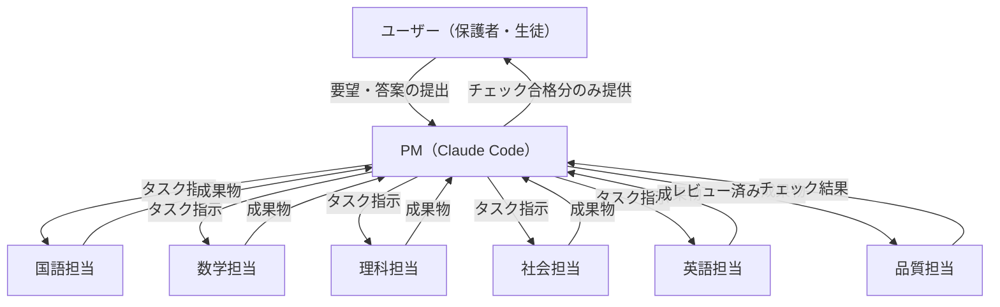
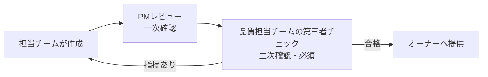

## はじめに

中学校程度の学習であれば、「苦手の把握 → 対策の実施 → 再チェック → 対策の見直し」というPDCAサイクルをきちんと回すことが有効だと考えています。ただ、これを一人ひとりに合わせて手軽にやろうとすると、これまでは学習塾や家庭教師をつけないとなかなか実現できませんでした。

そこに生成AIが登場して、「もしかしてこれ、AIでもできるのでは」と思い立ちました。ちょうど夏休みで、中学1年生の子供の前期期末試験対策という具体的なテーマもあったので、Claude Codeを使って「5教科担当＋品質チェック担当のAIチームを、PM（管理者）として運用する」という形で、実際に親子で試してみることにしました。

自分でプロンプトを書いて答案を作るのではなく、**Claude Code自身にサブエージェントを立ち上げさせ、教科ごとの担当・第三者チェック担当・進行管理役を分業させる**という体制です。1〜2週間の運用で、タスク数は約30、検出した品質指摘は200件を超え、途中で運用ルール自体を何度も書き換える羽目になりました。

この記事では、成果物の中身（教材そのもの）ではなく、**「複数エージェントに継続的なプロジェクトを任せるときに、どういう仕組みが必要になるか」**という運用面にフォーカスして、実際にぶつかった問題とその対処を書きます。個人の学習データが含まれるプロジェクトのため、点数などは相対的な表現に置き換えています。

対象読者は、Claude Codeで「単発のコーディングタスク」ではなく「複数日・複数エージェントにまたがる継続プロジェクト」を回してみたい人です。

## 概要

- 診断テスト→対策1週間後の確認テストで、5教科平均の正答率が約23ポイント（相対約4割）向上した
- フォルダ構成を「部署」に見立て、各サブエージェントの書き込み権限をフォルダ単位で制限した
- 成果物は「担当作成 → PMレビュー → 第三者品質チェック → 提供」の4段階を必須化し、**PM（Claude自身）が作ったものも例外にしなかった**
- 生成AIが作る問題集特有のバグ（設問に答えが漏れている）が5教科すべてで繰り返し発生し、「全文検索で正解語のヒット0件を確認する」という機械的なチェック手順に落とし込むまで収束しなかった
- サブエージェント起動時、判断業務（分析・レビュー）はOpus、作業業務（作問）はSonnet系、とタスク性質でモデルを使い分けてコストを抑えた
- プロジェクトの状態は全部Markdownファイルに永続化し、PCやセッションをまたいでも`PROJECT.md`と引き継ぎ文書を読み込むだけで再開できるようにした
- 最終的に子供本人が`/saiten`（採点）のようなスラッシュコマンドで自走できるところまで持っていった

対策開始前に試験範囲全体をカバーする診断テストを実施し、そこから約1週間の集中対策を経て実施した確認テストの結果を比較したところ、**5教科合計の平均正答率が、およそ23ポイント（相対で約4割）上昇**しました。

教科別に見ると、自己申告では「得意」と思われていた教科ほど伸び幅が小さく、逆に自己申告と実測が食い違っていた教科（診断テストで初めて弱点が判明した教科）ほど大きく伸びるという傾向がはっきり出ました。もともと得意だった教科はほぼ横ばいです。個々の点数は伏せますが、「勘や自己申告ではなく、実測データに基づいて学習時間の配分をやり直したこと」が、この伸びの主な要因だと考えています（詳細は後述の「診断テストで仮説を実データに置き換える」を参照）。

なお、これは中間の確認テストの結果であり、本番の期末試験はまだ先です。この記事では、この結果を生んだ**運用の仕組み**の話をメインに書きます。

## 全体アーキテクチャ：フォルダ構成をチーム制に見立てる

最初にやったのは、プロジェクトフォルダを「組織」として設計することでした。

```
プロジェクトルート/
├─ PROJECT.md              ← プロジェクト憲章（体制・ルール・品質ゲート定義）
├─ input/                  ← 試験範囲の原本（読み取り専用、全チーム参照可）
├─ PM/                     ← PMが一元管理する領域
│   ├─ requirements/       要件定義
│   ├─ tasks/              タスク一覧（全タスクをここに集約）
│   ├─ issues/             課題一覧（全課題をここに集約）
│   ├─ reviews/            レビュー記録
│   └─ log/                PM作業ログ
├─ 国語/ 数学/ 理科/ 社会/ 英語/ 品質管理/
│   ├─ Input/   ← PMや他チームから渡されるインプット
│   ├─ Output/  ← そのチームの成果物（レビュー待ち）
│   ├─ Work/    ← 作業用の下書き
│   └─ log/     ← そのチームの作業ログ
```

ポイントは2つです。

1つ目は、**各チーム（サブエージェント）は自分のフォルダ以外に書き込めない**というルールをPROJECT.mdに明文化したことです。これはツールレベルの強制ではなく「守らせるルール」ですが、指示に明記しておくだけでも、教科横断で他チームの成果物を勝手に上書きするような事故は一度も起きませんでした。

2つ目は、**タスクと課題を`PM/tasks/`・`PM/issues/`の1箇所に集約**したことです。各チームは自分のログに詳細を書きつつ、状態遷移（未着手／対応中／完了）は必ずPM側の一覧表にも反映させる。これにより、セッションが切れて再開したときも、この2ファイルとPM作業ログを読めば「今どこまで進んでいるか」を一目で復元できます。

技術的な補足をすると、ここでの「サブエージェント」は別プロセスやAPIを個別に叩いているわけではなく、Claude Codeに標準で備わっているエージェント起動機能を使っています。PM役のエージェントが「このタスクを、この役割・このモデルで実行して」という指示を渡すと、独立した文脈を持つエージェントがそのタスクだけをこなして結果を返す、という仕組みです。個々のサブエージェントの試行錯誤の過程（思考過程）はPM側の文脈を圧迫せず、PMは最終的な成果物とサマリーだけを受け取ります。役割・フォルダ・モデルを分けているのはこの仕組みの上に乗る運用ルールであり、ツール自体が強制しているわけではありません。

チーム構成を図にすると次のようになります。ユーザー（保護者・生徒）とやり取りするのはPMだけで、各教科担当・品質担当はPM経由でのみ動く構成です。



## 品質ゲートを必須化した理由：「答えが漏れている」問題

このプロジェクトで一番苦労したのが、**生成された問題集の設問文中に、その設問（や別の設問）の正解がそのまま書かれてしまう**という不具合でした。

最初に見つかったのは国語の学力測定試験で、漢字の書き取り問題の括弧書きに、答えの熟語がそのまま漢字で残っていたケースです。人間（保護者）がIDEで直接ファイルを開いて偶然発見しました。

これを機に品質担当チーム（別のサブエージェント）による第三者チェックを必須化したところ、同じパターンの不具合が国語・英語・理科で立て続けに、しかも1回の修正では収まらず**3〜4周**発覚しました。典型的なパターンは以下のようなものです。

- 選択問題の見出しや別の設問文に、正解語がそのまま登場している
- 選択肢のうち不正解の選択肢が、他の設問の定義文と一致するため消去法で正解が確定してしまう
- **修正のために語句を差し替えたこと自体が、新しい漏洩を生む**（例：ある正解語を別の語に置き換えたら、その別の語が実は他の設問の正解と衝突していた）

3つ目のパターンが特に厄介で、「直したはずなのに直っていない」を何度も繰り返しました。最終的にたどり着いた運用ルールは次のようなものです。

> 新規Output作成・修正の際は、正解語・正解値を一覧化し、配布物本文（見出しを含む）に対して**全文検索してヒット0件であることを確認し、その実測結果を作業ログに記録する**。修正時は変更箇所だけでなく**冊子全体を再走査**する。

「レビューで気をつける」という抽象的な指示だけでは再発を防げず、**全文検索してヒット件数を記録する、という機械的な手順にまで落とし込んで初めて収束した**のが実感としての学びです。LLMが「今回は大丈夫だろう」と思って見落とすパターンに対しては、曖昧な注意喚起ではなくチェックリスト化・検索コマンド化が効きます。

やっていること自体は地味で、正解語・正解値を一覧化したうえで、grep相当の全文検索ツールを使って配布物のファイルに1語ずつ検索をかけ、ヒット件数が0件であることを確認するだけです。特別な検証スクリプトを新たに書いたわけではなく、Claude Codeがもともとファイル内検索に使っている機能をそのまま品質チェック工程に転用した形です。「便利な検索コマンドが手元にあるCLIツールだからこそ、レビュー観点を検索クエリに変換して機械的に実行できる」という、CLI環境ならではの強みだと感じています。

## 成果物が「オーナー」に届くまでの必須フロー

上記の教訓から、最終的に成果物の提供フローを次の4段階に固定しました。

```
担当チーム作成 → PMレビュー（一次確認） → 品質担当チームの第三者チェック（二次確認・必須）
   → 品質チェック合格したもののみオーナー（子供・保護者）へ提供
```

フローチャートにすると次のとおりです。品質担当チームで指摘が出た場合は担当チームに差し戻し、合格するまでオーナーには渡さない、という単純なループになっています。



この4段階目までにいるのは「担当チーム」「PM」「品質担当」という**独立した3つの視点**です。同じセッション内で自己レビューだけを繰り返すと、当人（同じロールのAI）は同じ見落としを再生産しがちですが、役割を分けて「別エージェントとしてゼロから疑ってかかる」形にすると検出率が上がります。

## PM自身も例外なく品質チェックを受ける

運用のなかで象徴的だった出来事があります。ある週、PM（Claude自身）が「週次確認テスト」を直接作成し、品質担当のチェックを経ずにそのまま保護者に提供してしまったことがありました。

ユーザーから「品質担当チームのレビューは行いましたか」と問われて初めて、必須フローを自分がスキップしていたことに気づきました。

このとき取った対応は次の3つです。

1. まず正直に不備を認め、課題として起票する（隠さない・取り繕わない）
2. 通常のフローに戻し、品質担当チームによる正式チェックを実施する
3. **運用ルールを「PM自身が作成した成果物であっても例外なく品質担当チェックを経る」と明文化し直す**

「自分（PM）が作ったものは急ぎだから省略していい」という例外を一度でも許すと、その例外がなし崩しに広がるのは人間のプロジェクトでもよくある話です。AIエージェントを運用する場合も同様で、**ルールに例外を作らないこと自体をルールとして書く**必要があると実感しました。

## サブエージェントのモデル使い分け

トークンコストを抑えるため、サブエージェントを起動する際にタスクの性質でモデルを使い分けるルールもPROJECT.mdに明記しました。

| タスクの性質 | 使うモデル | 理由 |
|---|---|---|
| 弱点分析・品質チェック・採点などの判断業務 | 上位モデル（Opus） | 誤りが致命的になりやすく、見落としのコストが高い |
| 作問・模擬テスト作成・日程再設計などの生産業務 | デフォルト（Sonnet系） | 手順が明確で、上位モデルほどの推論深度を要さない |

「判断は高性能モデル、作業は標準モデル」という単純な切り分けですが、実際に効いたのは品質チェック工程です。前述の答え漏れ問題のような**「一見問題なさそうに見えるものの中から見落としを拾い上げる」タスク**は、上位モデルを充てたことで検出率が上がった実感があります。

## 診断テストで仮説を実データに置き換える

弱点分析は最初、保護者への聞き取り（定性情報）だけをもとに仮説ベースで進めていました。しかし「本人の自己申告」と「実際に測定した結果」は必ずしも一致しません。実際、試験範囲を偏りなくカバーする診断テストを作って実施・採点してみると、**得意だと思っていた教科が実は苦手で、苦手だと思っていた教科はむしろ得意**という、自己申告とは逆転した結果が複数教科で出ました。

この実データを受けて、1日あたりの学習時間配分（5教科合計は固定）を診断結果に応じて再配分しました。仮説と実測のズレが大きかった教科ほど時間配分を手厚くする、という単純なフィードバックループです。

さらに、失点の分析軸を「どの単元か」だけでなく「どういう答え方で失点しているか」（記号選択は正解できるが記述式は失点する、漢字の書き取りだけ極端に弱い、など）で見るようにしたところ、単元別の分析だけでは見えなかった傾向が浮かび上がりました。これは診断テストのような定量データがあって初めて可能になった分析です。

## 生徒本人が自走できるようにSkills化する

保護者が毎回内容を確認して橋渡しする運用から、最終的には子供自身がClaude Codeを操作できる形に寄せました。Claude Code Skillsとして、次の3つのスラッシュコマンドを用意しています。

| コマンド | 内容 |
|---|---|
| `/saiten` | 提出した答案（写真・PDF等）を採点し、正誤・解説・苦手分析つきでMarkdown/PDFを出力 |
| `/kokufuku` | 直近の誤答分析にもとづき、5教科まとめて苦手克服の復習問題を作成 |
| `/moshi` | 試験範囲全体から模擬試験を作成 |

採点の入口となる答案の提出方法もシンプルにしています。子供が解いた答案用紙をスマホのカメラで撮影し、その写真をそのまま`input/答案提出/`フォルダに置くだけです。手書きの解答用紙をテキストに変換する作業は不要で、`/saiten`実行時にClaude Codeが写真から手書きの解答を読み取り、正誤判定・採点まで一気通貫で行います。診断テストや週次確認テストの採点でも、保護者が撮影した答案画像をそのままエージェントに渡す運用で進めており、手書き答案を都度デジタル化する手間なしにAIでの採点サイクルを回せています。

例として、`/saiten`の中身（`SKILL.md`）から採点部分を抜粋します。単に「採点して」と指示するのではなく、読み取りの正直さ・解説の必須化・モデル指定まで手順として明文化しています。

```markdown
### 4. 採点する
判断業務（採点・分析）なので **Opusモデル** でサブエージェントを起動して採点させる。

採点エージェントへの指示に必ず含めること：
- 手書き文字は1問ずつ丁寧に読み取り、読み取りに自信が持てない箇所は正直にその旨を記録すること。
- 模範解答と照合し、正解・不正解（部分点があれば部分点）を判定すること。
- **正誤だけでなく、必ず解説をつけること。** 間違えた設問は「なぜ間違えたか」
  （概念の混同・計算のどこでつまずいたか・読み違い等）を具体的に分析する。
- 数学・理科など計算過程（途中式）が書かれている場合は、途中式のどこで
  つまずいたかも分析すること。
```

「読み取りに自信が持てない箇所は正直に申告させる」という一文は、手書き文字のOCR的な読み取りにハルシネーションが混じりやすいことへの対策として、運用の中で追加した項目です。

ここで意識したのは、**Skillsを使う場合でも、PROJECT.mdに定めた運用ルール（品質チェックを省略しない、答え漏れの全文検索チェックなど）が優先される**とSKILL.md自体に明記したことです。子供が直接使うツールほど「品質ゲートをうっかり飛ばす」リスクが高くなるため、ルールを1箇所（PROJECT.md）に書いて終わりにせず、末端のSkillにも同じ制約を埋め込む二重化をしています。

PDF変換は外部ライブラリに依存させたくなかったので、PC標準搭載のブラウザ（Edge/Chrome）をヘッドレスモードで起動してMarkdownをPDF化する自作スクリプトを用意しました。これにより、子供用のPCに追加のパッケージインストールを行わずに配布物をPDF化できています。

## ステートレスなAIに状態を持たせる：「引き継ぎ」の仕組み

このプロジェクトはOneDrive同期フォルダ内で運用しており、途中で作業用PCを何度か切り替えています。Claude Codeはセッションが切れれば記憶を失うので、**プロジェクトの状態を全部Markdownファイルとして永続化し、フォルダごと引き継げば別セッション・別PCでも再開できる**ようにしました。

具体的には次の2ファイルをセットで用意しています。

- `PROJECT.md`：体制・フォルダ構成・アクセスルール・品質ゲートの必須フロー・モデル使い分けなどの「憲法」
- `引継ぎ書.md` / `引継ぎプロンプト.md`：現在の進捗・今すぐ着手すべきこと・未解決の課題・主要ファイルの場所をまとめた「今日のダイジェスト」

新しいセッションでは、この2ファイルとタスク一覧・課題一覧・作業ログを読むだけで、直前のセッションの状況をほぼ完全に復元できます。実際、この記事を書いている今回のセッションも、この仕組みのおかげで前回までの経緯を数分で把握できました。

ここで工夫したのは、**プロジェクト内の相互参照をすべて相対パスにする**ことです。絶対パス（`C:\Users\...`のような記述）が紛れ込むと、PCが変わってドライブ文字やユーザー名が変わった瞬間に参照が壊れます。ファイル作成時にこの点を徹底したことで、PC移行に伴うトラブルはゼロでした。

## 得られた知見まとめ

複数エージェントに継続的なプロジェクトを任せる際の教訓を、汎用化して並べておきます。

1. **役割とフォルダの書き込み権限を1対1にする**。「自分のフォルダ以外に書かない」という単純なルールだけで、越権的な上書き事故を防げる。
2. **成果物の提供前チェックは、作った本人（同じロール）の自己レビューだけに頼らない**。第三者ロールのエージェントに独立してチェックさせる。
3. **ルールに例外を作らない、をルール自体に明記する**。「今回だけは急ぎだから省略」を一度許すと歯止めが効かなくなる。
4. **曖昧な注意喚起は再発防止にならない**。「気をつける」ではなく「全文検索してヒット0件を確認し記録する」のように、機械的に実行・検証できる手順に落とし込む。
5. **判断業務と作業業務でモデルを使い分けるとコスト効率が上がる**。特に「見落としを拾い上げる」系のタスクは上位モデルの効果を感じやすい。
6. **プロジェクトの状態は全部テキストファイルに落とす**。エージェントのメモリではなくファイルシステムを外部記憶として使うことで、セッション断・PC移行に強くなる。
7. **仮説だけで計画を立てず、可能なら定量データを取ってから再設計する**タイミングを計画に組み込む。

## おわりに

今回の取り組みは、Claude Codeを「コードを書かせるツール」としてではなく、**複数のサブエージェントとルールを備えた小さな組織のPMを任せるツール**として使った実験でした。冒頭に書いた約23ポイントの伸びも、教材の出来そのものより、「実測データに基づいて優先順位を決め直す」「品質ゲートを機械的に運用する」といった**仕組み側の設計**が効いた部分が大きいと感じています。

実際にやってみての率直な感想としては、たった1週間のトライアルでしたが、それでも手応えを感じるくらいの効果はあったように思います。「これが自分が子供の頃にあったら」と、少しうらやましくなったのが正直なところです。まだまだ粗削りな仕組みではありますが、こうしたノウハウを蓄積していけば、もっと一人ひとりに合わせたパーソナライズされたトレーニングに近づけていけそうです。子供本人にとっても、漠然と「勉強しなさい」と言われるよりも「今日はこれだけやればいい」とやることが明確になったのが良かったようで、その点は狙い通りの手応えでした。

本番の期末試験はまだ先なので、このプロジェクトはもうしばらく続きます。教材の中身そのものより、「継続的に動くマルチエージェント運用をどう壊れにくく設計するか」という点に、今後も多くの試行錯誤がありそうです。

同じような発想は、教育以外の継続プロジェクト（コンテンツ制作、リサーチ、社内ドキュメント整備など）にも応用できると思っています。もし似たような運用を試している方がいれば、ぜひ知見を交換したいです。
